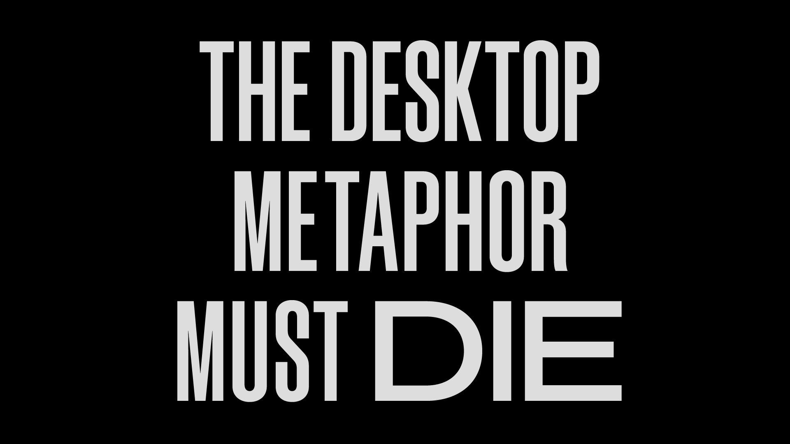

# The desktop metaphor must die
Why I set out to re-imagine the operating system
Почему я решил 

Amidst an unstable childhood, my Desktop was my retreat — a place I could find solace and belonging. The Start button was a gateway to opportunity and each Folder a comfortable if imperfect container for my belongings. No matter how overwhelming the outside world became, I knew that my Desktop would stay the same.

_В условиях_ переменчивого дества мой _компьютер/рабочий стол_ был убежищем ― местом где я мог найти _успокоение/отдушину/утешение_ и _близость/понимание/...[belonging]_. Кнопка Пуск была _вратами/порталом к возможностям_ и каждая Папка удобным, пусть и не совершенным, вместилищем для _моего добра_. Каким бы _гнетущим_ не был окружающий мир, я всегда знал, что _компьютер/на рабочем столе_ всё останется неизменным.

Years passed. Social media exploded, and the three years and ten thousand kilometers separating a teenager and his childhood dissolved with a click. My world was changing, but my Desktop stayed the same.

Шли годы. Социальные сети расползлись, и три года и десять тысяч километров, разделяющие подростка и его детство, растворились _по щелчку[три года]_. Мой мир менялся, а _компьютер_ оставался неизменным.

Years passed. And passed. And passed. As technology accelerated, so did society’s demands on our _collective bandwidths_. The smartphone boom led to an avalanche of Apps. Notifications multiplied pathogenically, and the corporations behind them soon learned to tug on my vulnerabilities — Engage! Now, before it’s too late!

Шли годы. И шли. И шли. Вместе с технологиями развивались и потребностями общества на _переработку информации_. Бум смартфонов привёл к _сходу лавины_ Приложений. Уведомления множились _как болезнь_, и корпорации _за ними_ вскоре научились тыкать в мои уязвимые точки: _Реагируй_! А то опоздаешь!

It all became too much, too fast. To quote a dear friend of mine, human beings simply aren’t equipped with the necessary bandwidth to process the explosion of information that our world has normalized.

Всё вокруг стало слишком _much_, слишком быстро. Цитируя моего хорошего друга: люди просто не наделены необходимой способностью к обработке информационного _взрыва/бомбордировки_, который общество сделало обыденностью.

To make things worse, it turns out that the desktop metaphor underlying so much of our computing was not equipped to handle it either. In response to the increased stimuli, our Desktops simply started generating more clutter. Windows upon windows of tabs and tabs, folders within folders of Untitled(1). Never-ending, nebulous clutter.

Что ещё хуже, оказывается, что метафора Рабочего стола, лежащая в основе нашего взаимодействия с компьютером, тоже не приспособлена к такому. В ответ на увеличивающееся количество _стимулов/возбудителей/раздражителей/импульсов_, наши _Рабочие столы_ стали просто создавать больше бардака. Окна поверх окон со вкладками из вкладок, папки в папках в Новой папке 2. _Бесконечный/глубокий_, смутный бардак.

This is because the Desktop was originally designed in 1973 to suit a very different need in computation—the need to mirror digital content with its physical equivalent (WYSIWYG, anyone?). But in a post-Internet world (at the cusp of 5G and the AI singularity, I might add), the way we consume and produce content has largely moved away from the baggage of physicality. It also doesn’t help that the Desktop has stayed the same for almost 50 years.

Это из-за того, что Рабочий стол был впервые спроектирован в 1973-ем, чтобы удовлетворить совершенно другую потребность _в использовании компьютера_ -- потребность в отражении цифрового мира с помощью его физического аналога (WYSIWYG, помните?). Но в мире пост-Интернета (я бы даже сказал, _на острие 5G и сингулярности ИИ_) наш способ потребления и создания информации ушёл далеко от _бремени телесности_. Всё усугубляется ещё и тем, что Рабочий стол не _меняется/менялся_ уже почти 50 лет.

Sure, recent iterations of the Desktop metaphor have introduced tools and prosthetics that have helped to extend the capabilities of our computers—virtual desktops and file stacks are two great examples of this. But in the end, they are all just crude workarounds—band-aids on a rotting wound.

Конечно, последние итерации метафоры Рабочего стола создали инструменты и _костыли/протезы_, которые помогли расширить возможности наших компьютеров: _воображаемые/виртуальные/цифровые_ рабочие столы и папки с файлами -- прекрасные тому примеры. Но в конце концов это просто уродливые подпорки/костыли -- _костыли для загнивающих культей. подоржник для загнивающих ран_

And when we strip away all the chrome—all the Aero and Paper and Frosted Glass, all the evidence of the “design systems” we have poured billions into developing and maintaining—we come face to face with a skeleton of XEROX PARC’s 1973 invention.

И если мы отбросим все _рюшечки/эмаль/хром/блестяшки_: все Aero, Paper, Frosted Galss -- все _оправдания_ "дизайн систем", на разработку и поддержку которых мы тратили миллиарды, мы увидим кости изобретения XEROX PARC из 1973-го.

## The Desktop Metaphor is Inhumane
Метафора Рабочего стола _бесчеловечна/антигуманна_

20 years ago, Jef Raskin (the founder of the Macintosh project) asserted that the desktop interface strategy was “inefficient and inhumane.”

20 лет назад, Джеф Раскин [Jef Raskin], основатель проекта Macintosh, заявил, что _~~стратегия~~ интерфейс рабочего стола_ "не эффективен и _антигуманен_".

Here are some of the key arguments he made in his book “The Humane Interface” (mixed with my personal analysis):

Вот ключевые аргументы, которые он привёл в своей книге "The Humane Interface" [Гуманный интерфейс] (с _вкраплениями моих умозаключений/исследований_):

1. **The Desktop environment enables Applications to exist**. Apps are modes, and anything modal in an interface sets the user up for errors and slips. Plus, the more ways there are to do something, the more time we spend fussing over our options instead of just doing it (Hick’s Law). The App economy is also just a massive waste of human capital—just think about all the wasted time we have collectively spent engineering the same feature again and again for every new App, when we could have been crafting unique commands that users can choose to obtain a la carte.

1. **Рабочий стол позволяет существовать Приложениям.** Приложения -- это модусы, а любая модальность в интерфейсе обрекает пользователя на ошибки и _неточности/промахи_. Также чем больше вариантов сделать что-то, тем больше времени мы тратим на _выбор/понянчиться/потрястись_ над вариантами вместо того, чтобы просто сделать это (закон Хика). Экономика Приложений это _огромная потеря_ _человеческого капитала_: просто подумайте, сколько времени мы все вместе потратили на создание одной и той же фичи снова и снова для каждого нового Приложения, когда мы могли придумывать новые _возможности/рычаги_ для пользователей, чтобы _они могли делать выбор/на выбор_.

2. **The Desktop’s reliance on the mouse as a pointing device is extraordinarily inefficient to navigate.**

2. _**Использование мышки для взаимодействия с Рабочим столом черезвычайно неэффективно**_

3. **File naming and organization as a whole is an exercise in futility.** When saving a document, for example, our locus of attention is not on coming up with a unique and memorable name—we just want to save our work. Seemingly minor moments of friction such as this burdens our cognitive load, distracting us from our intentions and from entering flow state.

In addition, as someone who lives with a delightful host of neuroatypicalities, I have found it impossible to get anything done unless I reach flow-state. The frictions and distractions in conventional operating environments make that all but impossible. And don’t tell me that it’s just a matter of discipline. Because…

## The System has failed us.

Raskin defines the ideal humane interface as “responsive to human needs and considerate of human frailties.” For a while I wasn’t sure what he meant by that second bit, until I came to the following realization:

An interface that intentionally exploits the vulnerability of human beings for financial or otherwise selfish gain is inhumane and also despicable.

**An interface that unintentionally allows the former to take place has
not been considerate of the full extent of human fragility, and is therefore still inhumane.**

The endless News Feed casinos that were designed specifically to turn a generation of people into machine-state information banks? **Inhumane**

The tippity-tappity stream of Stories optimized to maximize ~engagement~? **Inhumane.**

The **desktop AND mobile operating systems** that allowed for the former interaction paradigms to exist in unchecked Sandbox-App environments? **Inhumane.**

It is time for the Desktop metaphor to die.

## So…what now?
И что теперь?..

For 46 years we have been iterating and building our lives upon a system that is fundamentally inhumane. We have relied on and waited for the permission of the tech titans to move from one paradigm to the next. But I think the “technology revolution” has yet to come. The true revolution will come when we are able to demand and author change from a grassroots level.

And so, I have made it my life’s mission to help inspire this change in any way that I can. I have spent the past nine months feverishly digging rabbit holes—researching, questioning, and prototyping—every “answer” uncovering even more questions.

That said, I think I’ve finally found something worth *sharing* with the world.

## Introducing Mercury.

Mercury is a speculative vision of a modeless, fluid operating system driven by human intent.

It is designed for a tablet device with keyboard and multi-touch input affordances. This was a choice I made to maximize scalability in the road towards the true north star of device agnosticism. It also happens to be an existing device category currently stuck in between two worlds, with the potential to become something far greater than the sum of its parts.

I also wish to emphasize that the ultimate goal of presenting Mercury to the world is to start conversations in the design communities I am grateful to be a part of. In doing so, I hope to open up this white-male dominated narrative to more voices of the world.

I do not believe Mercury to be the only direction worth pursuing. However, I do hope that it will be a source of inspiration for young designers who are trying to find their place in the industry.

### Because the world doesn’t need another operating system.

### The world needs more voices asking questions.

And with that, let’s begin the conversation.

The full case study will be released week of May 27, 2019. In the mean time, you may visit the site below for a teaser.

mercuryos.com